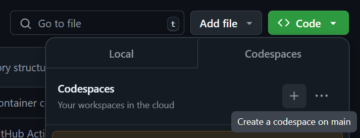

# PyTCT-docs

PyTCT Documents

## Setup Instructions

### GitHub Codespace (Recommended)

1. **Create Codespace**

    Select Create codespace from the `+` button  
    

### Local PC

1. **Install uv**

    [uv](https://docs.astral.sh/uv/getting-started/installation/) is a Python package manager

    ```bash
    curl -LsSf https://astral.sh/uv/install.sh | sh
    ```

2. **Install Dependencies**

    ```bash
    uv sync
    ```

## Edit Documents

### Edit While Previewing Changes

1. **Serve the Documentation Locally**:
    Run the following command to start the live-reloading docs server and see your changes:

    ```bash
    uv run mkdocs serve
    ```

### Adding New Document Files

When you add a new Markdown file to the documentation, follow these steps to ensure it is properly integrated and displayed:

1. **Add the Markdown file**:
    - Place your new Markdown file in the `docs/` directory.

2. **Update `mkdocs.yml`**:
    - Open the `mkdocs.yml` configuration file.
    - Add an entry for your new Markdown file under the `nav` section to include it in the navigation.

    Example:
    ```yaml
    nav:
      - Home: index.md
      - New Page: new_page.md
    ```

### Reflect Changes on the Production Site

1. **Commit and Push Changes**:
    - Commit your changes to the repository and push them to the remote repository.

    After committing to the main branch, the document site is automatically built and updated using GitHub Actions.
