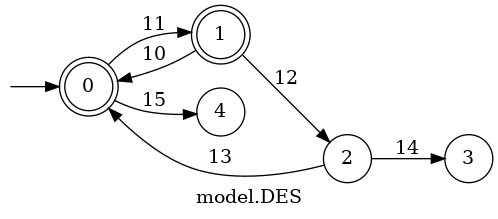

# PyTCT Basic Sample

## Initialize PyTCT

PyTCT will create a lot of files in the current directory. You may think it is disturbing.
PyTCT has a feature its file save a specified directory. Let's setup. 

```python
import pytct

pytct.init("save_dir")
```

That's all. When you run this program, you will have created a folder named save_dir. 
If you run it again, you will get an error. This is because PyTCT does not allow you to recreate a folders with names that exist.
If you want to overwrite, set the overwrite argument to True.

```python
import pytct

pytct.init("save_dir", overwrite=True)
```


## Create Model

Let's create automaton model of DES.

```python
delta = [
    (0,11,1),
    (1,10,0),
    (1,12,2),
    (2,14,3),
    (2,13,0),
    (0,15,4)
]
Qm = [0,1]
pytct.create("model", 5, delta, Qm)
```

you have to pass four argument to `create` function.
First argument is DES name. it can use any string.
Second argument is number of state. In this example, there are states from 0 to 4, so the value is 5.
Third argument is transition tuple. An element must be defined in the order of `(exit state, event, enter state)`.
Forth argument is marker state list.

## Display Automaton of DES

Once the model has been created, the automaton of DES can be visualized as an image.
Here is example.

```python
model = pytct.AutomatonDisplay("model")
model.render()
```

You will see the following image.




The ``AutomatonDisplay`` class provides various visualization-related functions.

This completes the introduction of the simple PyTCT functions.
If you want to know more about the various functions, please go to reference page.